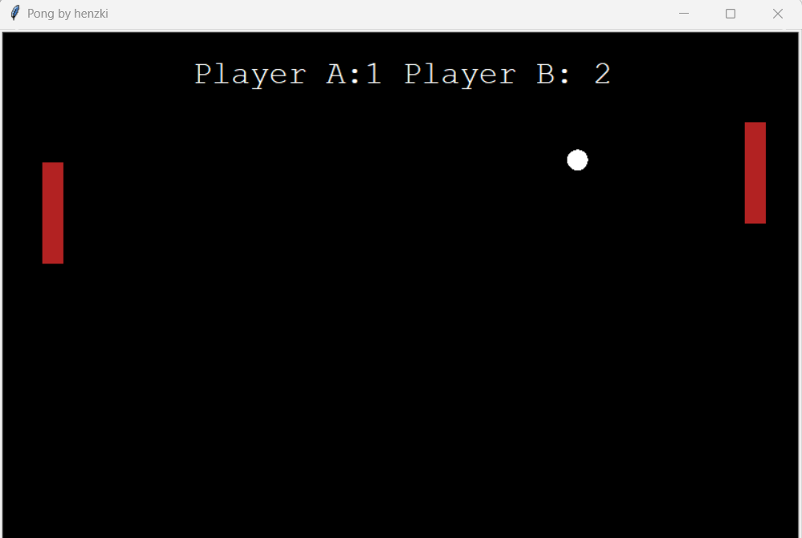

# Ping Pong game with Pygame

Game with two paddles and a ball. The left paddle moves up with "w" and down with "s" and the right paddle moves up and down with the arrow keys.

 

---

Tutorial: [Python Game Programming with TokyoEdTech](https://www.youtube.com/playlist?list=PLlEgNdBJEO-kXk2PyBxhSmo84hsO3HAz2)
